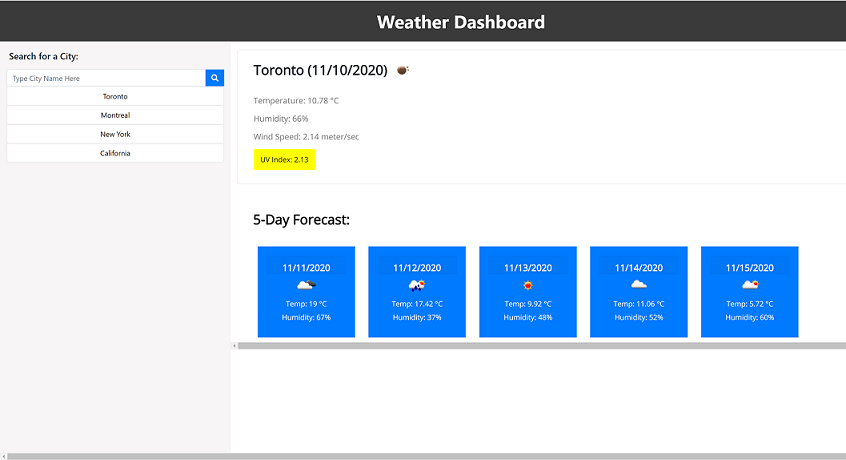

# Weather Dashboard

## Description
This is a weather dashboard application that allows a user to see current and 5-day weather outlook for multiple cities. This application has been developed using HTML, CSS, JavaScript, jQuery, MomentJS JavaScript library, Ajax, and Server-side APIs from OpenWeather API. This app will run in the browser and features dynamically updated HTML and CSS powered by jQuery and OpenWeather API. 

User can use this application to search for a city to view current weather conditions and 5-day forecast for that city. The current weather conditions include the temperature, the humidity, the wind speed, and the UV index. The UV index is presented with a color that indicates whether the conditions are favorable, moderate, or severe. The 5-day forecast displays the date, an icon representation of weather conditions, the temperature, and the humidity.
The searched city is added to the search history and and is stored in localStorage.
User can click on a city in the search history  to view current and future weather conditions for that city.

This source code is available to everyone under the standard MIT license.

Technologies Used: HTML5, CSS3, JavaScript, jQuery, MomentJS, Ajax and OpenWeather API.

## Installation

To install this code, download the zip file and extract the files to a designated directory on your web server or computer without changing the directory/folder structure, or use GitHub's guidelines to clone the repository. 

## Screenshot of the application:

## Link to deployed website:
https://nagck.github.io/weatherdashboard

## Usage 

The application can be accessed via any standard browser on any device supported by the browser.

## Credits

- The website has been primarily developed using HTML5, CSS3, JavaScript, jQuery, MomentJS, Ajax, OpenWeather API.  

- Sincere thanks to my course instructors Ed (Edward Apostol), Adam (Adam El-Masri), Anas (Anas Qazi) and Herman (German Arcila) for teaching and helping me in acquring HTML/CSS/JavaScript/jQuery/API skills. And of course thanks to my fellow students for sharing valuable tips and tricks on Slack study groups.

- Here are some websites that I referred to develop the application code:
    * https://www.w3schools.com/js/default.asp
    * https://developer.mozilla.org/en-US/docs/Web/JavaScript
    * https://getbootstrap.com/
    * https://www.w3schools.com/css/default.asp
    * https://css-tricks.com/
    * https://momentjs.com/
    * https://jquery.com/
    * https://openweathermap.org/api

## License
Licensed under the [MIT](https://choosealicense.com/licenses/mit/) license.

## Feedback
Feedback is always appreciated. If you are interested in fixing any issues and contributing directly to the code base, please provide at  https://github.com/nagck/weatherdashboard/pulls

---

